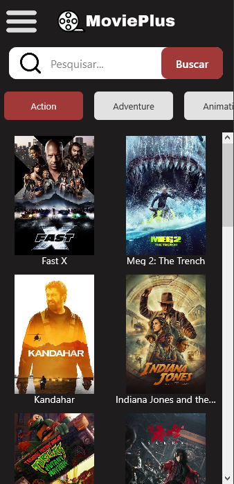
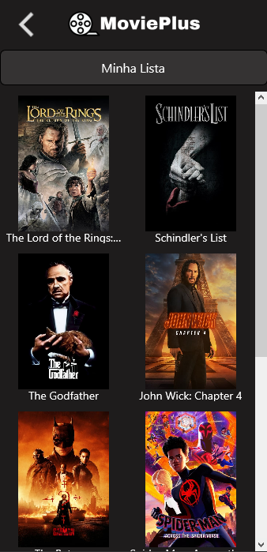
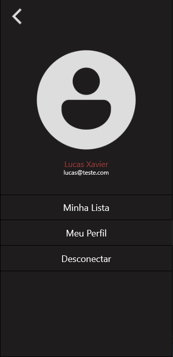

# MoviePlus - Um Aplicativo de Listagem de Filmes

MoviePlus é um aplicativo simples para listar filmes populares usando a API do The Movie Database (TMDb).

## Recursos Principais

- Listagem de filmes populares.
- Exibição de detalhes do filme.
- Busca por filmes.
- Visualização de pôsteres de filmes.

## Capturas de Tela

## Tecnologias Utilizadas

Neste projeto, foram utilizadas as seguintes tecnologias e bibliotecas:

- **Delphi 11:** Delphi é uma linguagem de programação e ambiente de desenvolvimento integrado (IDE) usado para construir aplicativos para Windows, macOS, iOS, Android e muito mais.

- **DataSet.Serialize.Config:** Biblioteca que oferece recursos avançados de serialização de objetos para datasets em Delphi.

- **RESTRequest4D:** Uma biblioteca para simplificar solicitações HTTP em Delphi, facilitando a comunicação com APIs RESTful.

- API do The Movie Database (TMDb)

## Design e Protótipos

- **Figma:** Você pode visualizar os designs e protótipos deste projeto no Figma [clicando aqui](https://www.figma.com/file/l9XOMwcRuzetCFEr13BMUR/MoviePlus?type=design&node-id=0%3A1&mode=design&t=4C9ywqtg8W7qfk3J-1).
